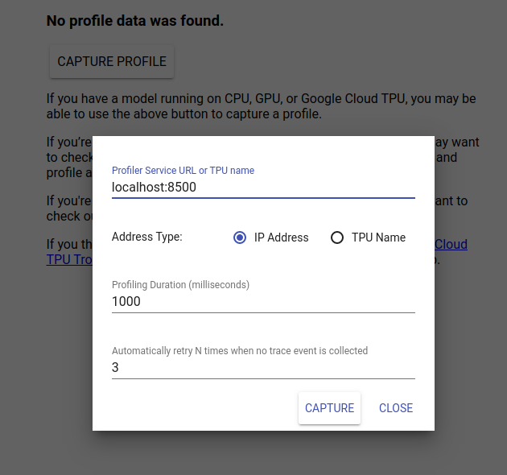

# Profile Inference Requests with TensorBoard

After deploying TensorFlow Serving and issuing requests from your client, you
may notice that requests take longer than you expected, or you are not achieving
the throughput that you would have liked.

In this guide, we will use TensorBoard's Profiler, which you may already use to
[profile model training](https://www.tensorflow.org/tensorboard/tensorboard_profiling_keras),
to trace inference requests to help us debug and improve inference performance.

You should use this guide in conjunction with the best practices denoted in the
[Performance Guide](performance.md) to optimize your model, requests and
TensorFlow Serving instance.

## Overview

At a high level, we will point TensorBoard's Profiling tool at TensorFlow
Serving's gRPC server. When we send an inference request to Tensorflow Serving,
we will also simultaneously use the TensorBoard UI to ask it to capture the
traces of this request. Behind the scenes, TensorBoard will talk to TensorFlow
Serving over gRPC and ask it to provide a detailed trace of the lifetime of the
inference request. TensorBoard will then visualize the activity of every thread
on every compute device (running code integrated with
[`profiler::TraceMe`](https://github.com/tensorflow/tensorflow/blob/f65b09f9aedcd33d0703cbf3d9845ea2869c0aa8/tensorflow/core/profiler/lib/traceme.h#L73))
over the course of the lifetime of the request on the TensorBoard UI for us to
consume.

## Prerequisites

*   `Tensorflow>=2.0.0`
*   TensorBoard (should be installed if TF was installed via `pip`)
*   Docker (which we'll use to download and run TF serving>=2.1.0 image)

## Deploy model with TensorFlow Serving

For this example, we will use Docker, the recommended way to deploy Tensorflow
Serving, to host a toy model that computes `f(x) = x / 2 + 2` found in the
[Tensorflow Serving Github repository](https://github.com/tensorflow/serving/tree/master/tensorflow_serving/servables/tensorflow/testdata/saved_model_half_plus_two_cpu/00000123).

Download the TensorFlow Serving source.

```
git clone https://github.com/tensorflow/serving /tmp/serving
cd /tmp/serving
```

Launch TensorFlow Serving via Docker and deploy the half_plus_two model.

```
docker pull tensorflow/serving
MODELS_DIR="$(pwd)/tensorflow_serving/servables/tensorflow/testdata"
docker run -it --rm -p 8500:8500 -p 8501:8501 \
-v $MODELS_DIR/saved_model_half_plus_two_cpu:/models/half_plus_two \
-v /tmp/tensorboard:/tmp/tensorboard \
-e MODEL_NAME=half_plus_two \
tensorflow/serving
```

In another terminal, query the model to ensure model is deployed correctly

```
curl -d '{"instances": [1.0, 2.0, 5.0]}' \
-X POST http://localhost:8501/v1/models/half_plus_two:predict

# Returns => { "predictions": [2.5, 3.0, 4.5] }
```

## Set up TensorBoard's Profiler

In another terminal, launch the TensorBoard tool on your machine, providing a
directory to save the inference trace events to:

```
mkdir -p /tmp/tensorboard
tensorboard --logdir /tmp/tensorboard --port 6006
```

Navigate to http://localhost:6006/ to view the TensorBoard UI. Use the drop-down
menu at the top to navigate to the Profile tab. Click Capture Profile and
provide the address of Tensorflow Serving's gRPC server.



As soon as you press "Capture," TensorBoard will start sending profile requests
to the model server. In the dialog above, you can set both the deadline for each
request and the total number of times Tensorboard will retry if no trace events
are collected. If you are profiling an expensive model, you may want to increase
the deadline to ensure the profile request does not time out before the
inference request completes.

## Send and Profile an Inference Request

Press Capture on the TensorBoard UI and send an inference request to TF Serving
quickly thereafter.

```
curl -d '{"instances": [1.0, 2.0, 5.0]}' -X POST \
http://localhost:8501/v1/models/half_plus_two:predict
```

You should see a "Capture profile successfully. Please refresh." toast appear at
the bottom of the screen. This means TensorBoard was able to retrieve trace
events from TensorFlow Serving and saved them to your `logdir`. Refresh the page
to visualize the inference request with The Profiler's Trace Viewer, as seen in
the next section.

Note: If you see `tensorflow.python.framework.errors_impl.UnimplementedError` in
your TensorBoard logs, it likely means you are running a Tensorflow Serving
version older than 2.1.

## Analyze the Inference Request Trace


You can now easily see what computation is taking place as a result of your
inference request. You can zoom and click on any of the rectangles (trace
events) to get more information such as exact start time and wall duration.

At a high-level, we see two threads belonging to the TensorFlow runtime and a
third one that belongs to the REST server, handling the receiving of the HTTP
request and creating a TensorFlow Session.

We can zoom in to see what happens inside the SessionRun.


In the second thread, we see an initial ExecutorState::Process call in which no
TensorFlow ops run but initialization steps are executed.

In the first thread, we see the call to read the first variable, and once the
second variable is also available, executes the multiplication and add kernels
in sequence. Finally, the Executor signals that its computation is done by
calling the DoneCallback and the Session can be closed.

## Next Steps

While this is a simple example, you can use the same process to profile much
more complex models, allowing you to identify slow ops or bottlenecks in your
model architecture to improve its performance.

Please refer to
[TensorBoard Profiler Guide](https://www.tensorflow.org/tensorboard/tensorboard_profiling_keras#trace_viewer)
for a more complete tutorial on features of TensorBoard's Profiler and
[TensorFlow Serving Performance Guide](performance.md) to learn more about
optimizing inference performance.
